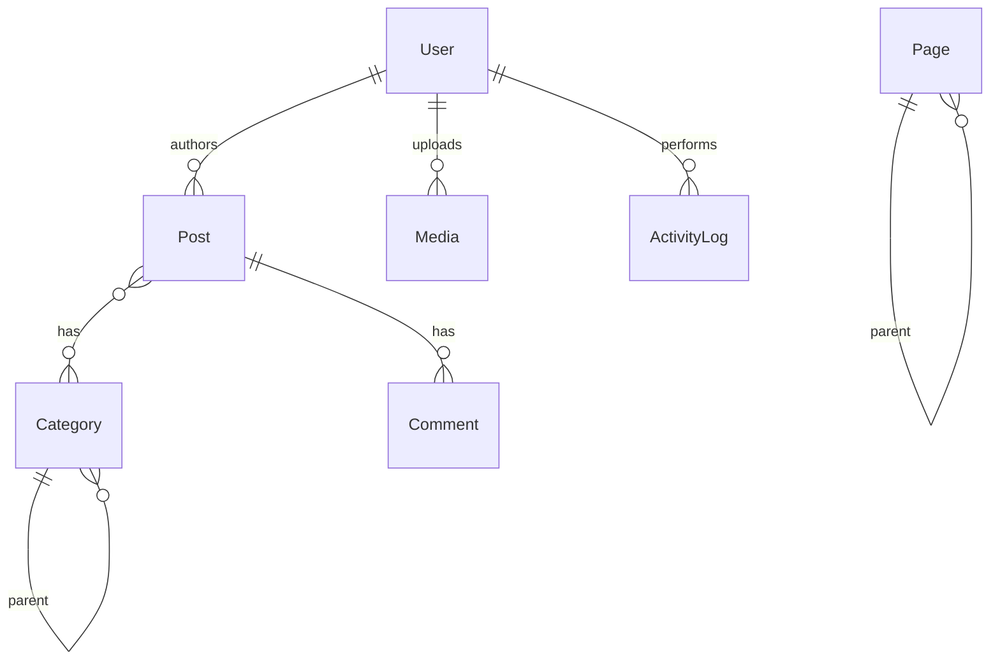

# CorePress CMS

A modern, headless content management system built with TypeScript, React, Node.js, MongoDB, and Python AI services.

## 📋 Table of Contents

- [Overview](#overview)
- [Features](#features)
- [Architecture](#architecture)
- [Technology Stack](#technology-stack)
- [Prerequisites](#prerequisites)
- [Installation](#installation)
- [Development](#development)
- [API Documentation](#api-documentation)
- [Database Design](#database-design)
- [Testing](#testing)
- [Deployment](#deployment)
- [Security](#security)
- [Troubleshooting](#troubleshooting)
- [Contributing](#contributing)
- [Roadmap](#roadmap)
- [License](#license)
- [Support](#support)

## Overview

CorePress CMS is a modern, headless content management system designed to provide a lightweight, flexible, and powerful alternative to traditional CMS platforms like WordPress. Built with React, Next.js, Node.js, and Python AI services, CorePress offers an intuitive admin interface, a fast public website, and AI-powered features.

### Problem Statement

Many small businesses, schools, bloggers, and organizations need a website they can update without editing code. WordPress solves this problem, but it has become:

- **Heavy** — bloated with unnecessary features
- **Plugin-dependent** — requires numerous plugins for basic functionality
- **Hard to customize** — complex theme and plugin development
- **Slow** — performance issues on many hosts
- **Security-prone** — frequent security patches needed

### Solution

CorePress CMS addresses these issues by providing:

- **Headless architecture** — decoupled frontend and backend
- **Modern tech stack** — built with current technologies
- **AI integration** — smart content generation and optimization
- **Role-based access** — granular user permissions
- **Fast performance** — server-side rendering and static generation
- **Developer-friendly** — clean code, TypeScript, and RESTful APIs

## Features

### Core Features

- User authentication — secure login with JWT and role-based access control
- Post management — create, edit, delete, and publish blog posts
- Page management — create and manage static pages
- Rich text editor — full-featured editor powered by TipTap
- Media library — upload, manage, and optimize media files
- Category & tag system — organize content with categories and tags
- SEO optimization — built-in tools with meta tags and descriptions
- User roles — five roles: Super Admin, Admin, Editor, Author, Viewer
- Activity logging — track all user actions and system events
- Theme support — dark/light mode with customizable themes
- Responsive design — mobile-first across all devices
- RESTful API — clean, well-documented endpoints

### AI-Powered Features

- AI content generation — generate blog posts with OpenAI
- SEO analysis — real-time SEO analysis and suggestions
- Image optimization — automatic compression and optimization
- Spam detection — AI-powered spam detection for comments

### Advanced Features (in progress / planned)

- Theme customization — colors, fonts, and layout
- PWA support — progressive web app capability
- Plugin system — extensible plugin architecture
- E-commerce — online store functionality
- Analytics dashboard — built-in analytics and reporting

## Architecture

```
┌─────────────────────────────────────────────────────────────────┐
│                      Public Website (Next.js)                   │
│                        SSR/SSG Pages                            │
└─────────────────────────────────────────────────────────────────┘
                              │
                              ▼
┌─────────────────────────────────────────────────────────────────┐
│                    Admin Dashboard (React)                      │
│      Posts │ Pages │ Media │ Users │ Settings │ Analytics       │
└─────────────────────────────────────────────────────────────────┘
                              │
                              ▼
┌─────────────────────────────────────────────────────────────────┐
│                      Backend API (Node.js)                      │
│      Auth │ Posts │ Pages │ Media │ Categories │ Settings       │
└─────────────────────────────────────────────────────────────────┘
                              │
                              ▼
┌─────────────────────────────────────────────────────────────────┐
│                   Python Services (FastAPI)                     │
│    AI Writer │ SEO Checker │ Image Optimizer │ Spam Detector    │
└─────────────────────────────────────────────────────────────────┘
                              │
                              ▼
┌─────────────────────────────────────────────────────────────────┐
│                        MongoDB Database                         │
└─────────────────────────────────────────────────────────────────┘
```

## Technology Stack

### Frontend

| Technology | Purpose |
|---|---|
| React 18 + TypeScript | Admin dashboard UI |
| Next.js 14 + TypeScript | Public website with SSR/SSG |
| Tailwind CSS | Styling framework |
| Lucide React | Icon library |
| TipTap | Rich text editor |
| Vite | Build tool for admin |
| React Router | Client-side routing |

### Backend

| Technology | Purpose |
|---|---|
| Node.js + Express | RESTful API server |
| TypeScript | Type safety |
| MongoDB + Mongoose | Database and ODM |
| JWT + bcrypt | Authentication |
| Cloudinary | Media storage and CDN |
| Multer | File upload handling |

### Python Services

| Technology | Purpose |
|---|---|
| FastAPI | Python API framework |
| OpenAI API | AI content generation |
| Pillow | Image processing |
| OpenCV | Advanced image optimization |
| Uvicorn | ASGI server |

### DevOps

| Technology | Purpose |
|---|---|
| Docker | Containerization |
| Docker Compose | Service orchestration |
| GitHub Actions | CI/CD |
| Vercel | Frontend hosting |
| Render / Railway | Backend hosting |
| MongoDB Atlas | Database hosting |

## Prerequisites

Before installing, make sure you have:

- Node.js 18+ (LTS recommended)
- Python 3.9+
- MongoDB 6+
- Docker (optional, for containerized setup)
- npm or yarn
- An OpenAI API key (for AI features)
- A Cloudinary account (for media storage)

## Installation

### 1. Clone the repository

```bash
git clone https://github.com/yourusername/corepress-cms.git
cd corepress-cms
```

### 2. Install dependencies

```bash
# Install all dependencies at once
npm run install-all

# Or install individually
cd backend && npm install
cd ../admin && npm install
cd ../website && npm install
cd ../python-services && pip install -r requirements.txt
```

### 3. Configure environment variables

Copy the example environment files:

```bash
cp backend/.env.example backend/.env
cp admin/.env.example admin/.env
cp website/.env.example website/.env
cp python-services/.env.example python-services/.env
```

**Backend (`backend/.env`)**

```env
NODE_ENV=development
PORT=5000
API_URL=http://localhost:5000

MONGODB_URI=mongodb://localhost:27017
MONGODB_DB_NAME=corepress_db

JWT_SECRET=your_jwt_secret_key_change_this_in_production
JWT_EXPIRES_IN=7d
BCRYPT_SALT_ROUNDS=12

CLOUDINARY_CLOUD_NAME=your_cloudinary_cloud_name
CLOUDINARY_API_KEY=your_cloudinary_api_key
CLOUDINARY_API_SECRET=your_cloudinary_api_secret

PYTHON_SERVICE_URL=http://localhost:8000

CLIENT_URL=http://localhost:3000
ADMIN_URL=http://localhost:5173

MAX_FILE_SIZE_MB=10
ALLOWED_FILE_TYPES=image/jpeg,image/png,image/gif,image/webp,image/svg+xml,video/mp4,video/webm,application/pdf
```

**Admin (`admin/.env`)**

```env
VITE_API_URL=http://localhost:5000/api
VITE_ENV=development
VITE_APP_VERSION=1.0.0
VITE_ENABLE_PWA=true
```

**Website (`website/.env`)**

```env
NEXT_PUBLIC_API_URL=http://localhost:5000/api
NEXT_PUBLIC_SITE_URL=http://localhost:3000
NEXT_PUBLIC_PYTHON_URL=http://localhost:8000
```

**Python Services (`python-services/.env`)**

```env
ENV=development
OPENAI_API_KEY=your_openai_api_key_here
OPENAI_MODEL=gpt-4
API_PORT=8000
API_HOST=0.0.0.0
```

### 4. Start MongoDB

```bash
# Using Docker
docker run -d -p 27017:27017 --name mongodb mongo:7

# Or using a local installation
mongod --dbpath /path/to/data
```

### 5. Start development servers

```bash
# Start all services at once
npm run dev

# Or start individually
npm run dev:backend      # Backend API on port 5000
npm run dev:admin        # Admin dashboard on port 5173
npm run dev:website      # Public website on port 3000
npm run dev:python       # Python services on port 8000
```

### 6. Seed the database (optional)

```bash
cd backend
npm run seed
```

## Development

### Project Structure

```
corepress-cms/
├── backend/                    # Node.js API
│   ├── src/
│   │   ├── config/             # Configuration files
│   │   ├── controllers/        # Route controllers
│   │   ├── models/             # Mongoose models
│   │   ├── routes/             # API routes
│   │   ├── middleware/         # Express middleware
│   │   ├── services/           # Business logic
│   │   ├── utils/              # Utility functions
│   │   ├── app.ts              # Express app setup
│   │   └── server.ts           # Server entry point
│   ├── package.json
│   └── .env
│
├── admin/                       # React admin dashboard
│   ├── src/
│   │   ├── api/                # API client
│   │   ├── components/         # React components
│   │   ├── hooks/              # Custom hooks
│   │   ├── pages/              # Page components
│   │   ├── types/              # TypeScript types
│   │   ├── utils/              # Utility functions
│   │   ├── App.tsx             # Main app component
│   │   └── main.tsx            # Entry point
│   ├── package.json
│   └── vite.config.ts
│
├── website/                      # Next.js public website
│   ├── app/
│   │   ├── blog/                # Blog pages
│   │   ├── [slug]/              # Dynamic pages
│   │   ├── layout.tsx           # Root layout
│   │   └── page.tsx             # Homepage
│   ├── components/              # React components
│   ├── lib/                     # Utilities
│   ├── package.json
│   └── next.config.ts
│
├── python-services/              # Python AI services
│   ├── app/
│   │   ├── main.py              # FastAPI entry point
│   │   ├── ai_writer.py         # AI content generation
│   │   ├── seo_checker.py       # SEO analysis
│   │   ├── image_optimizer.py   # Image optimization
│   │   └── spam_detector.py     # Spam detection
│   ├── requirements.txt
│   └── .env
│
├── docker-compose.yml            # Docker Compose configuration
└── README.md                     # This file
```

### Available Scripts

```bash
# Development
npm run dev                  # Start all services
npm run dev:backend          # Start backend only
npm run dev:admin            # Start admin only
npm run dev:website          # Start website only
npm run dev:python           # Start Python services only

# Building
npm run build                # Build all services
npm run build:backend        # Build backend
npm run build:admin          # Build admin
npm run build:website        # Build website

# Testing
npm run test                 # Run all tests
npm run test:backend         # Test backend
npm run test:admin           # Test admin
npm run test:website         # Test website

# Linting & formatting
npm run lint                 # Lint all code
npm run format                # Format code

# Production
npm start                    # Start production servers
```

### Code Style

The project uses:

- **TypeScript** for type safety
- **ESLint** for code quality
- **Prettier** for code formatting

```bash
npm run format    # Format code
npm run lint      # Lint and fix
```

## API Documentation

### Authentication

| Method | Endpoint | Description | Access |
|---|---|---|---|
| POST | `/api/auth/register` | Register new user | Public |
| POST | `/api/auth/login` | Login user | Public |
| GET | `/api/auth/me` | Get current user | Private |
| POST | `/api/auth/logout` | Logout user | Private |
| POST | `/api/auth/refresh-token` | Refresh JWT token | Private |
| POST | `/api/auth/change-password` | Change password | Private |
| POST | `/api/auth/forgot-password` | Request password reset | Public |
| POST | `/api/auth/reset-password` | Reset password | Public |

### Posts

| Method | Endpoint | Description | Access |
|---|---|---|---|
| GET | `/api/posts` | Get all posts | Public |
| GET | `/api/posts/search` | Search posts | Public |
| GET | `/api/posts/:id` | Get post by ID | Public |
| GET | `/api/posts/slug/:slug` | Get post by slug | Public |
| GET | `/api/posts/:id/related` | Get related posts | Public |
| POST | `/api/posts` | Create post | Private |
| PUT | `/api/posts/:id` | Update post | Private |
| DELETE | `/api/posts/:id` | Delete post | Private |
| PATCH | `/api/posts/:id/publish` | Toggle publish status | Private |

### Pages

| Method | Endpoint | Description | Access |
|---|---|---|---|
| GET | `/api/pages` | Get all pages | Public |
| GET | `/api/pages/:id` | Get page by ID | Public |
| GET | `/api/pages/slug/:slug` | Get page by slug | Public |
| POST | `/api/pages` | Create page | Private |
| PUT | `/api/pages/:id` | Update page | Private |
| DELETE | `/api/pages/:id` | Delete page | Private |

### Media

| Method | Endpoint | Description | Access |
|---|---|---|---|
| GET | `/api/media` | Get all media | Private |
| GET | `/api/media/:id` | Get media by ID | Private |
| POST | `/api/media/upload` | Upload media | Private |
| PUT | `/api/media/:id` | Update media metadata | Private |
| DELETE | `/api/media/:id` | Delete media | Private |
| POST | `/api/media/bulk-delete` | Bulk delete media | Private |

### Categories

| Method | Endpoint | Description | Access |
|---|---|---|---|
| GET | `/api/categories` | Get all categories | Public |
| GET | `/api/categories/tree` | Get category hierarchy | Public |
| GET | `/api/categories/:id` | Get category by ID | Public |
| GET | `/api/categories/slug/:slug` | Get category by slug | Public |
| POST | `/api/categories` | Create category | Private |
| PUT | `/api/categories/:id` | Update category | Private |
| DELETE | `/api/categories/:id` | Delete category | Private |

### Settings

| Method | Endpoint | Description | Access |
|---|---|---|---|
| GET | `/api/settings` | Get settings | Public |
| GET | `/api/settings/navigation` | Get navigation menu | Public |
| PUT | `/api/settings` | Update settings | Private |
| PUT | `/api/settings/navigation` | Update navigation | Private |
| POST | `/api/settings/reset` | Reset settings | Private |

### SEO

| Method | Endpoint | Description | Access |
|---|---|---|---|
| POST | `/api/seo/analyze` | Analyze SEO | Private |
| POST | `/api/seo/validate` | Validate SEO metadata | Private |
| GET | `/api/seo/post/:id` | Generate SEO metadata | Private |
| GET | `/api/seo/sitemap.xml` | Generate sitemap | Public |
| GET | `/api/seo/robots.txt` | Generate robots.txt | Public |

### Python Services

| Method | Endpoint | Description | Access |
|---|---|---|---|
| GET | `/health` | Health check | Public |
| POST | `/ai/generate-post` | Generate AI content | Private |
| POST | `/ai/generate-title` | Generate title suggestions | Private |
| POST | `/ai/rewrite` | Rewrite content | Private |
| POST | `/seo/analyze` | Analyze SEO | Private |
| POST | `/seo/suggest` | Get SEO suggestions | Private |
| POST | `/image/optimize` | Optimize image | Private |
| POST | `/image/resize` | Resize image | Private |
| POST | `/spam/check` | Check for spam | Public |

## Database Design

### Collections

**Users**

```javascript
{
  _id: ObjectId,
  name: String,
  email: String (unique),
  password: String (hashed),
  role: String (super_admin | admin | editor | author | viewer),
  avatar: String,
  isActive: Boolean,
  lastLogin: Date,
  resetPasswordToken: String,
  resetPasswordExpires: Date,
  createdAt: Date,
  updatedAt: Date
}
```

**Posts**

```javascript
{
  _id: ObjectId,
  title: String,
  slug: String (unique),
  content: Mixed (TipTap JSON),
  excerpt: String,
  status: String (draft | published | archived),
  featuredImage: String,
  author: ObjectId (ref: User),
  categories: [ObjectId] (ref: Category),
  tags: [String],
  seoTitle: String,
  seoDescription: String,
  views: Number,
  likes: Number,
  publishedAt: Date,
  createdAt: Date,
  updatedAt: Date
}
```

**Pages**

```javascript
{
  _id: ObjectId,
  title: String,
  slug: String (unique),
  content: Mixed,
  status: String (draft | published),
  seoTitle: String,
  seoDescription: String,
  template: String,
  parentPage: ObjectId (ref: Page),
  order: Number,
  isHomepage: Boolean,
  isPrivacyPolicy: Boolean,
  isTermsOfService: Boolean,
  createdAt: Date,
  updatedAt: Date
}
```

**Categories**

```javascript
{
  _id: ObjectId,
  name: String (unique),
  slug: String (unique),
  description: String,
  parentCategory: ObjectId (ref: Category),
  color: String,
  order: Number,
  createdAt: Date,
  updatedAt: Date
}
```

**Media**

```javascript
{
  _id: ObjectId,
  fileName: String,
  fileUrl: String,
  fileType: String,
  fileSize: Number,
  publicId: String,
  altText: String,
  width: Number,
  height: Number,
  format: String,
  uploadedBy: ObjectId (ref: User),
  metadata: Mixed,
  isOptimized: Boolean,
  optimizedUrl: String,
  thumbnailUrl: String,
  createdAt: Date,
  updatedAt: Date
}
```

**Settings**

```javascript
{
  _id: ObjectId,
  siteName: String,
  siteDescription: String,
  siteLogo: String,
  siteFavicon: String,
  siteUrl: String,
  primaryColor: String,
  secondaryColor: String,
  accentColor: String,
  fontFamily: String,
  footerText: String,
  navigationMenu: [NavigationItem],
  homePageLayout: String,
  postsPerPage: Number,
  analyticsId: String,
  googleSiteVerification: String,
  enableComments: Boolean,
  enableGdpr: Boolean,
  enableAnalytics: Boolean,
  maintenanceMode: Boolean,
  maintenanceMessage: String,
  customCss: String,
  customJs: String,
  customHead: String,
  customFooter: String,
  createdAt: Date,
  updatedAt: Date
}
```

**Activity Logs**

```javascript
{
  _id: ObjectId,
  userId: ObjectId (ref: User),
  action: String,
  details: String,
  ipAddress: String,
  userAgent: String,
  timestamp: Date,
  metadata: Mixed,
  severity: String (info | warning | error | critical),
  createdAt: Date,
  updatedAt: Date
}
```

### Relationships



## Testing

### Coverage Goals

- **Unit tests**: 80% coverage minimum
- **Integration tests**: 70% coverage minimum
- **E2E tests**: critical user flows

### Running Tests

```bash
npm run test               # Run all tests
npm run test:coverage      # Run tests with coverage
npm run test:backend       # Backend only
npm run test:admin         # Admin only
npm run test:website       # Website only
npm run test:watch         # Watch mode
```

### Example Test Cases

**Authentication**

| ID | Test Case | Input | Expected Result |
|---|---|---|---|
| AUTH-01 | Register valid user | Name, email, password | 201 Created |
| AUTH-02 | Register duplicate email | Existing email | 409 Conflict |
| AUTH-03 | Login valid user | Correct credentials | 200 Success |
| AUTH-04 | Login invalid password | Wrong password | 401 Unauthorized |
| AUTH-05 | Token refresh | Valid refresh token | New access token |

**Posts**

| ID | Test Case | Input | Expected Result |
|---|---|---|---|
| POST-01 | Create post (author) | Valid post data | 201 Created |
| POST-02 | Create post (viewer) | Valid post data | 403 Forbidden |
| POST-03 | Get published posts | No filters | 200 Success |
| POST-04 | Get post by slug | Existing slug | 200 Success |
| POST-05 | Update post (author) | Valid update | 200 Success |
| POST-06 | Delete post (author) | Own post | 200 Success |

## Deployment

### Docker

```bash
docker-compose up -d       # Build and run
docker-compose logs -f     # View logs
docker-compose down        # Stop services
```

### Manual Deployment

**Backend (Render / Railway / DigitalOcean)**

```bash
cd backend
npm run build
npm start
```

**Admin Dashboard (Vercel / Netlify)**

```bash
cd admin
npm run build
# Deploy the 'dist' folder
```

**Public Website (Vercel)**

```bash
cd website
npm run build
# Deploy to Vercel
```

**Python Services (Render / Railway)**

```bash
cd python-services
pip install -r requirements.txt
uvicorn app.main:app --host 0.0.0.0 --port 8000
```

### Production Environment Variables

```env
# Backend
NODE_ENV=production
MONGODB_URI=your_production_mongodb_uri
JWT_SECRET=your_secure_jwt_secret
CLOUDINARY_CLOUD_NAME=your_cloudinary_name
CLOUDINARY_API_KEY=your_cloudinary_api_key
CLOUDINARY_API_SECRET=your_cloudinary_api_secret
PYTHON_SERVICE_URL=https://python-services.yourdomain.com

# Admin
VITE_API_URL=https://api.yourdomain.com

# Website
NEXT_PUBLIC_API_URL=https://api.yourdomain.com
NEXT_PUBLIC_SITE_URL=https://yourdomain.com

# Python Services
OPENAI_API_KEY=your_openai_api_key
ENV=production
```

### Docker Compose Reference

```yaml
version: '3.8'

services:
  website:
    build: ./website
    ports:
      - "3000:3000"
    environment:
      - NEXT_PUBLIC_API_URL=http://backend:5000/api
      - NEXT_PUBLIC_PYTHON_URL=http://python-services:8000
    depends_on:
      - backend
      - python-services

  backend:
    build: ./backend
    ports:
      - "5000:5000"
    environment:
      - MONGODB_URI=mongodb://mongodb:27017/corepress
      - PYTHON_SERVICE_URL=http://python-services:8000
    depends_on:
      - mongodb

  python-services:
    build: ./python-services
    ports:
      - "8000:8000"
    environment:
      - OPENAI_API_KEY=${OPENAI_API_KEY}
      - ENV=production
    volumes:
      - ./uploads:/app/uploads

  mongodb:
    image: mongo:7
    ports:
      - "27017:27017"
    volumes:
      - mongodb_data:/data/db

volumes:
  mongodb_data:
```

## Security

### Authentication & Authorization

- JWT-based authentication
- Password hashing with bcrypt and salt rounds
- Role-based access across five user roles
- Secure token refresh mechanism

### Data Protection

- Input validation on all user inputs
- Injection prevention via Mongoose ODM
- XSS protection through input sanitization
- File upload restrictions on type and size

### Security Headers & Middleware

- Helmet.js for security headers
- Properly configured CORS
- Rate limiting to prevent brute-force attacks
- Token-based CSRF protection

### Monitoring

- Activity logging for all user actions
- Error tracking (e.g. Sentry integration)
- Performance monitoring (Web Vitals)
- Regular security audits

## Troubleshooting

**MongoDB connection error**

```bash
# Check if MongoDB is running
docker ps | grep mongodb
# Or for a local installation
ps aux | grep mongod
```

**Port already in use**

```bash
lsof -i :5000
kill -9 PID
```

**OpenAI API key missing**

```bash
# Add your key to python-services/.env
OPENAI_API_KEY=your_api_key_here
```

**Cloudinary configuration missing**

```bash
# Add credentials to backend/.env
CLOUDINARY_CLOUD_NAME=your_cloudinary_name
CLOUDINARY_API_KEY=your_cloudinary_api_key
CLOUDINARY_API_SECRET=your_cloudinary_api_secret
```

## Contributing

1. Fork the repository
2. Create a feature branch: `git checkout -b feature/amazing-feature`
3. Commit your changes: `git commit -m 'Add some amazing feature'`
4. Push to the branch: `git push origin feature/amazing-feature`
5. Open a Pull Request

### Commit Convention

```
feat: Add new feature
fix: Fix bug
docs: Update documentation
style: Code style changes
refactor: Code refactoring
perf: Performance improvements
test: Add tests
chore: Maintenance tasks
```

### Code Standards

- Use TypeScript for all code
- Follow ESLint rules
- Write tests for new features
- Update documentation
- Use meaningful variable names

### Pull Request Checklist

- [ ] Code follows style guidelines
- [ ] Tests are included
- [ ] Documentation is updated
- [ ] No breaking changes without discussion
- [ ] All tests pass

## Roadmap

**Phase 1: MVP** — Complete
- User authentication with roles
- Post and page management
- Rich text editor
- Media upload and management
- Category and tag system
- SEO optimization
- Activity logging

**Phase 2: Enhancement** — In progress
- AI content generation
- SEO analysis
- Image optimization
- Spam detection
- Analytics dashboard

**Phase 3: Advanced Features** — Planned
- Plugin system
- Theme marketplace
- Drag-and-drop builder
- Comment system
- Newsletter system

**Phase 4: Enterprise** — Planned
- Multi-site support
- E-commerce
- Membership system
- Backup and restore
- API rate limiting

## License

This project is licensed under the MIT License — see the [LICENSE](LICENSE) file for details.

## Acknowledgments

- [Express.js](https://expressjs.com/) — web framework
- [React](https://reactjs.org/) — UI library
- [Next.js](https://nextjs.org/) — React framework
- [MongoDB](https://www.mongodb.com/) — database
- [TipTap](https://tiptap.dev/) — rich text editor
- [Tailwind CSS](https://tailwindcss.com/) — CSS framework
- [OpenAI](https://openai.com/) — AI services
- [Cloudinary](https://cloudinary.com/) — media storage
- [FastAPI](https://fastapi.tiangolo.com/) — Python API framework

## Support

- Issues: use the GitHub Issues tab on this repository
- Documentation: see the `/docs` folder in this repository
